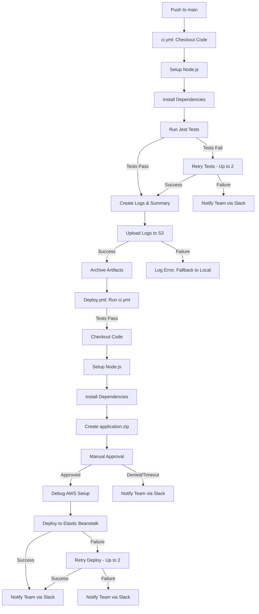
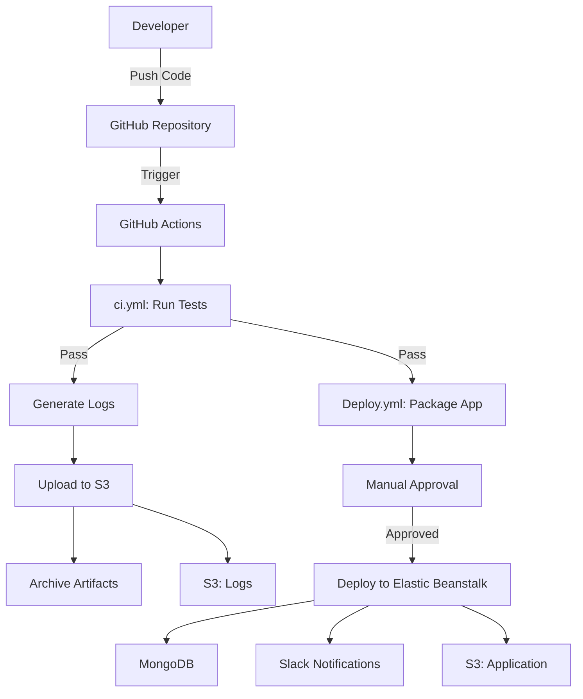
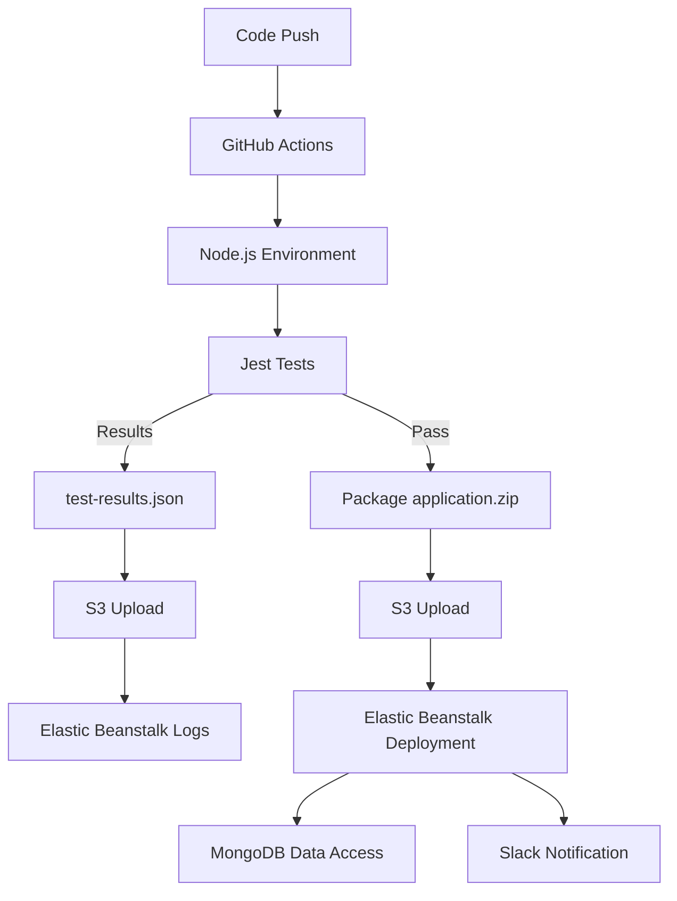

# Automation Workflow: Purpose & Functionalities

## What Is an Automation Workflow?

An automation workflow is a predefined sequence of automated actions and decisions designed to streamline, optimize, and execute tasks or processes with minimal human intervention. It functions like a digital assembly line, where input data or events trigger a series of steps, leading to efficient and reliable outcomes.

## Purpose of Automation Workflows

Automation workflows aim to:

- **Save time and reduce manual effort**: Automate repetitive tasks to free up human resources.
- **Improve accuracy and consistency**: Standardize processes to eliminate human errors.
- **Increase efficiency and productivity**: Enable faster processing and higher volume handling.
- **Ensure compliance and auditability**: Log and monitor steps for regulatory or quality control.
- **Enhance scalability**: Support process growth without proportional resource increases.
- **Enable complex process orchestration**: Seamlessly connect multiple systems and tools.

## Key Functionalities of an Automation Workflow

An automation workflow typically includes:

- **Triggering Mechanism**: Event or condition that initiates the workflow (e.g., new email, file upload, scheduled time).
- **Conditional Logic / Decision Points**: Branches for different paths based on data or outcomes (e.g., if-else, switch cases).
- **Actions**: Automated tasks like sending emails, updating databases, running scripts, or calling APIs.
- **Loops / Iterations**: Repeat actions over lists or until conditions are met (e.g., retrying a failed API call).
- **Data Handling**: Pass, transform, or store data between steps.
- **Error Handling**: Detect and manage failures or exceptions, including retry logic and fallback actions.
- **Notifications and Approvals**: Alert humans or require manual sign-off (e.g., approval before deployment).
- **Logging and Reporting**: Record events and outcomes for traceability.

### Error Handling in Detail

Error handling ensures workflows remain robust by managing failures gracefully. Common strategies include:

- **Retry Logic**: Automatically retry a failed action (e.g., API call) a set number of times before escalating. For example, retrying a database connection up to three times with a delay between attempts.
- **Fallback Actions**: Execute alternative steps if the primary action fails (e.g., using a cached dataset if a live API is down).
- **Error Notifications**: Alert relevant stakeholders (e.g., via email or Slack) with details of the failure for manual intervention.
- **Logging Errors**: Record failure details (e.g., error codes, timestamps) for debugging and auditability.
  These mechanisms ensure workflows can recover from issues or escalate them appropriately, minimizing downtime and manual intervention.

## Components of an Automation Workflow

| Component      | Description                                 |
| -------------- | ------------------------------------------- |
| Trigger        | Event that initiates the workflow           |
| Input          | Data received at the start                  |
| Steps          | Individual actions or operations            |
| Conditions     | Decision logic to direct workflow paths     |
| Branches       | Alternative paths the workflow can take     |
| Loops          | Repeat a set of steps for multiple items    |
| Outputs        | Final results, notifications, or reports    |
| Integrations   | Connections to external systems (APIs, DBs) |
| Error Handlers | Mechanisms to recover or alert on errors    |

## Example Automation Workflow Diagram

### Email Support Ticket System Automation

```
[Trigger: New Email Received]
           |
           v
[Parse Email Content]
           |
           v
[Check if Email Contains "Urgent"]
        /       \
      Yes       No
      /           \
[Send Alert]   [Create Support Ticket]
      |             |
      v             v
[Notify Support Team via Slack]
```

- **Trigger**: New incoming email starts the workflow.
- **Parse Email**: Extract content, subject, sender.
- **Condition**: Check if the email is marked as urgent.
- **Actions**: Send alert for urgent emails or create a ticket otherwise.
- **Notify**: Inform the support team via Slack.

## Real-World Examples

### Example 1: Employee Onboarding Workflow

- **Trigger**: HR submits a new hire form.
- **Steps**:
  - Create user accounts (email, internal systems).
  - Assign access permissions.
  - Schedule orientation meetings.
  - Send welcome email with resources.
  - Notify IT to prepare hardware.
- **Outcome**: New employee is fully onboarded without HR manually contacting departments.

### Example 2: E-commerce Order Fulfillment

- **Trigger**: Customer places an order.
- **Steps**:
  - Verify payment.
  - Check inventory.
  - Update order status.
  - Send confirmation email to customer.
  - Notify warehouse to pack and ship.
  - Update shipping tracking once shipped.
- **Outcome**: Faster, reliable order processing with fewer errors.

### Example 3: API Retry and Approval Workflow

- **Trigger**: A new data sync request is received from an external system.
- **Steps**:
  - Attempt to call the target API to fetch data (up to 3 retries, 5-second delay between attempts).
  - If API call succeeds, process and store data in a database.
  - If API call fails after retries, use cached data as a fallback and log the error.
  - If data is critical (e.g., financial data), send an approval request to a manager via email.
  - Wait for manager approval (manual step) before proceeding.
  - Notify the team via Slack with sync status.
- **Outcome**: Ensures reliable data syncing with robust error handling and human oversight for critical operations.

## Workflow Tools & Platforms

Automation workflows are created and managed with tools like:

- **Zapier, Integromat (Make), Microsoft Power Automate**: Cloud platforms for app integration and workflow automation.
- **Apache Airflow, Jenkins**: For complex data pipelines or DevOps workflows.
- **Robotic Process Automation (RPA)**: UiPath, Automation Anywhere for GUI-based workflows.
- **Custom scripts and cron jobs**: Simple automation for technical users.

## Detailed Automation Workflow Example with Diagram

### Scenario: Customer Support Escalation Workflow

| Step | Action Description                           | Purpose                               |
| ---- | -------------------------------------------- | ------------------------------------- |
| 1    | Trigger: New support ticket created          | Start workflow when ticket comes in   |
| 2    | Check ticket priority (low, medium, high)    | Decide next steps based on urgency    |
| 3a   | If high priority, assign to Tier 2 support   | Faster resolution for critical issues |
| 3b   | If medium priority, assign to Tier 1 support | Normal handling process               |
| 3c   | If low priority, send auto-response with FAQ | Reduce workload via self-service      |
| 4    | Notify assigned team via email and Slack     | Ensure visibility and quick response  |
| 5    | Monitor ticket status and escalate if needed | Enforce service-level agreements      |
| 6    | Close ticket and send satisfaction survey    | Get feedback for quality control      |

### Diagram

```
[New Ticket Created]
          |
          v
[Check Priority] -----> [High] ---> [Assign to Tier 2]
          |                   |          |
          |                   v          v
          |                 [Notify Team]
          |                   |
          |-----> [Medium] ---> [Assign to Tier 1] --> [Notify Team]
          |
          |-----> [Low] -----> [Send Auto-response]
                               |
                               v
                        [Wait for Customer Reply]
```

## How to Design an Automation Workflow

1. **Define clear goals**: Identify tasks to automate and desired outcomes.
2. **Identify triggers**: Determine events that start the workflow.
3. **Map out the steps**: List the sequence of actions needed.
4. **Add decision points**: Include conditional logic for different paths.
5. **Consider data flow**: Define how data is passed, transformed, or stored.
6. **Include error handling**: Plan for failure recovery or alerts (e.g., retries, fallbacks).
7. **Test and optimize**: Run with test data and refine as needed.

## Benefits Recap

| Benefit      | Explanation                                  |
| ------------ | -------------------------------------------- |
| Efficiency   | Faster task completion with less manual work |
| Accuracy     | Eliminates human error                       |
| Scalability  | Handles growing workload without extra staff |
| Transparency | Logs and audit trails for compliance         |
| Consistency  | Repeatable and reliable execution            |
| Cost Savings | Reduces labor and operational costs          |

## GitHub Actions Workflows for RentSync Project

This section details the `ci.yml` and `Deploy.yml` workflows for the RentSync project, demonstrating automation in a CI/CD pipeline with explicit conditional logic, error handling, and logging.

### Prerequisites

- **GitHub Secrets**: `AWS_ACCESS_KEY_ID`, `AWS_SECRET_ACCESS_KEY`, `MONGODB_URI`, `JWT_SECRET` in `Settings > Secrets and variables > Actions`.
- **AWS Resources**: S3 bucket `elasticbeanstalk-ap-southeast-2-591408364730` with `test-logs/` and `DEV-API/DEVAPI-env/logs/`. Elastic Beanstalk application `DEV API`, environment `DEVAPI-env` in `ap-southeast-2`.
- **Node.js Project**: `package.json` with Jest (`npm install --save-dev jest`, `"test": "jest"`), Node.js 18.
- **.ebextensions**: Add `logs.config` to project root for Elastic Beanstalk logs.

### `ci.yml` - Continuous Integration

**Purpose**: Runs Jest tests, generates logs, and exports test data with retry logic for robustness.
**Triggers**:

- Push to `main`.
- Pull request to `main`.

**Steps**:

1. Checkout code (`actions/checkout@v3`).
2. Set up Node.js 18 (`actions/setup-node@v3`).
3. Install dependencies (`npm install`).
4. Debug Jest setup (logs version, dependencies).
5. Run tests with retry logic (`npx jest --ci --json` with up to 2 retries on failure).
6. Debug test results (logs `test-results.json`).
7. Create custom log and `test-summary.json`.
8. Upload logs to S3 (`test-logs/`) and Elastic Beanstalk (`DEV-API/DEVAPI-env/logs/`).
9. Archive `test-results.json`, `test-results-custom.log`, `test-summary.json`.

**Conditional Logic**:
| Step | Condition | Action | Outcome |
| ---- | --------- | ------ | ------- |
| 5 | Tests pass | Proceed to log creation and upload | Artifacts and logs stored |
| 5 | Tests fail after retries | Log failure, notify team via Slack | Workflow fails, team alerted |
| 8 | S3 upload succeeds | Archive artifacts | Artifacts available in Actions tab |
| 8 | S3 upload fails | Log error, use fallback local storage | Artifacts stored locally |

**Outputs**:

- **Artifacts**: Download from `Actions` tab (`https://github.com/Evan-Codes88/CI-CD-api/actions`).
- **S3**: `s3://elasticbeanstalk-ap-southeast-2-591408364730/test-logs/test-results-<commit-sha>.log`.
- **Elastic Beanstalk**: `DEV API` > `DEVAPI-env` > `Logs` or `s3://elasticbeanstalk-ap-southeast-2-591408364730/DEV-API/DEVAPI-env/logs/`.
- **Test Summary**: `test-summary.json` for reuse.

### `Deploy.yml` - Deployment

**Purpose**: Deploys to Elastic Beanstalk after successful testing, with manual approval for production-like environments.
**Triggers**:

- Push to `main`.

**Steps**:

1. Run `ci.yml` tests (dependency via `needs`).
2. Checkout code, set up Node.js, install dependencies.
3. Create `application.zip`.
4. Request manual approval (for production-like environments).
5. Debug AWS setup.
6. Deploy to Elastic Beanstalk via S3.
7. Notify team via Slack on success or failure.

**Conditional Logic**:
| Step | Condition | Action | Outcome |
| ---- | --------- | ------ | ------- |
| 1 | `ci.yml` tests pass | Proceed to deployment steps | Deployment continues |
| 1 | `ci.yml` tests fail | Skip deployment, notify team | Workflow fails, team alerted |
| 4 | Approval granted | Proceed to deployment | Application deployed |
| 4 | Approval denied or timeout | Skip deployment, log failure | Workflow fails, team notified |
| 6 | Deployment succeeds | Notify team via Slack | Application live |
| 6 | Deployment fails | Retry up to 2 times, then notify team | Workflow fails, team alerted |

**Outputs**:

- **Logs**: `Actions` tab, `deploy` job.
- **Revisions**: Elastic Beanstalk `DEV API` versions, S3 `application.zip`.

### CI/CD Workflow Diagram



### Debugging

- **No Runs**: Check `Actions` tab, ensure `main` branch commits, verify Actions enabled in `Settings`.
- **S3/Beanstalk Failures**: Review `Debug AWS setup` logs, confirm secrets, test S3 permissions (`aws s3 ls`).
- **Test Failures**: Check `Debug Jest setup` and `Debug test results` logs, ensure `package.json` has `"test": "jest"`.
- **401 Errors**: Verify `JWT_SECRET`, middleware in `index.js`.
- **MongoDB**: Ensure `MONGODB_URI` in GitHub secrets and Elastic Beanstalk environment properties.

### Notes

- Runner: `ubuntu-latest` (2.324.0).
- Artifacts: 90-day retention.
- Persistent logs in S3/Elastic Beanstalk.
- Add `.ebextensions/logs.config` for log visibility.

## Services and Technologies Used in RentSync

RentSync is an application, designed for managing rental inspections and synchronising rental data, leveraging a robust continuous integration/continuous delivery (CI/CD) pipeline to automate code testing, and deployment. The pipeline ensures high code quality, rapid deployment, and scalability while minimising manual intervention. The CI/CD process integrates multiple services and technologies, orchestrated through GitHub Actions workflows (`ci.yml` and `Deploy.yml`), to deliver a reliable and efficient development lifecycle.

The API CI/CD pipeline relies on a comprehensive stack of services and technologies, each contributing to the automation workflow. Below is an **extensive** breakdown of each component, including its purpose, functionalities, configuration details, role in RentSync, and comparisons to alternative tools.

### GitHub

- **Purpose**: GitHub is the primary platform for version control, code collaboration, and hosting the CI/CD workflows for RentSync.
- **Functionalities**:
  - **Version Control**: Uses Git to track code changes, enabling branching and merging strategies (e.g., feature branches, `main`).
  - **Collaboration**: Supports pull requests, code reviews, and issue tracking.
  - **CI/CD Integration**: Hosts GitHub Actions for automated workflows.
  - **Secrets Management**: Stores sensitive data like `AWS_ACCESS_KEY_ID`, `AWS_SECRET_ACCESS_KEY`, `MONGODB_URI`, and `JWT_SECRET`.
- **Configuration in RentSync**:
  - Repository: `https://github.com/Evan-Codes88/CI-CD-api`.
  - Secrets stored in `Settings > Secrets and variables > Actions`.
  - Workflows defined in `.github/workflows/ci.yml` and `.github/workflows/Deploy.yml`.
- **Comparison to Alternatives**:
  - **GitLab**: Offers built-in CI/CD pipelines, container registry, and DevOps tools but requires more setup for external integrations like AWS. GitLab’s self-hosted option adds flexibility but increases maintenance.
  - **Bitbucket**: Provides similar version control and CI/CD (via Pipelines), but its community and third-party integrations are less extensive than GitHub’s.
  - **Azure DevOps**: Enterprise-focused with robust CI/CD but tightly coupled to Microsoft’s ecosystem.
- **Role in RentSync**: Hosts the source code, triggers CI/CD workflows on push/pull requests to `main`, and manages secrets for secure access to AWS and MongoDB.

### GitHub Actions

- **Purpose**: Automates the CI/CD pipeline by executing predefined workflows triggered by repository events.
- **Functionalities**:
  - **Workflow Definition**: YAML-based workflows (`ci.yml`, `Deploy.yml`) define jobs and steps.
  - **Triggers**: Supports events like `push`, `pull_request`, or manual triggers.
  - **Runners**: Executes jobs on virtual machines (e.g., `ubuntu-latest`, version 2.324.0).
  - **Actions Marketplace**: Reuses pre-built actions (e.g., `actions/checkout@v3`, `aws-actions/configure-aws-credentials@v2`).
  - **Artifact Storage**: Stores outputs (e.g., test logs) for 90 days.
- **Configuration in RentSync**:
  - **Runner**: `ubuntu-latest` for compatibility and performance.
  - **Triggers**: `push` and `pull_request` to `main` for `ci.yml`; `push` to `main` for `Deploy.yml`.
  - **Secrets**: Uses GitHub Secrets for AWS and MongoDB credentials.
- **Comparison to Alternatives**:
  - **Jenkins**: Open-source, highly customizable, but requires self-hosting and complex setup compared to GitHub Actions’ cloud-native approach.
  - **CircleCI**: Cloud-based, scalable, but incurs costs for high usage and requires external integration with GitHub.
  - **Travis CI**: Simple for open-source projects but less flexible for complex workflows compared to GitHub Actions.
- **Role in RentSync**: Executes `ci.yml` for testing and `Deploy.yml` for deployment, orchestrating the entire CI/CD process with conditional logic and error handling.

### Node.js

- **Purpose**: A JavaScript runtime environment for building and running the RentSync application.
- **Functionalities**:
  - **Server-Side JavaScript**: Executes JavaScript outside browsers, ideal for APIs.
  - **NPM Ecosystem**: Manages dependencies via `package.json`.
  - **Asynchronous Processing**: Handles I/O operations efficiently (e.g., API calls, database queries).
- **Configuration in RentSync**:
  - Version: Node.js 18 (specified in `actions/setup-node@v3`).
  - Dependencies: Defined in `package.json`, installed via `npm install`.
  - Test Script: `"test": "jest"` in `package.json` for running Jest tests.
- **Comparison to Alternatives**:
  - **Python (Flask/Django)**: Better for rapid prototyping or data-heavy applications but requires learning a different language.
  - **Java (Spring Boot)**: Robust for enterprise applications but verbose and resource-heavy.
  - **Go**: Fast and lightweight but lacks Node.js’s extensive library ecosystem.
- **Role in RentSync**: Powers the application backend, executes tests, and is packaged for deployment to Elastic Beanstalk.

### Jest

- **Purpose**: A JavaScript testing framework for ensuring RentSync’s code quality.
- **Functionalities**:
  - **Unit Testing**: Tests individual functions and modules.
  - **Integration Testing**: Verifies interactions between components (e.g., API endpoints, MongoDB).
  - **Mocking**: Simulates external dependencies (e.g., API responses).
  - **Reporting**: Outputs test results in JSON (`test-results.json`).
- **Configuration in RentSync**:
  - Installed via `npm install --save-dev jest`.
  - Run with `npx jest --ci --json --outputFile=test-results.json`.
  - Retry logic: Up to 2 retries with 5-second delays.
- **Comparison to Alternatives**:
  - **Mocha**: Flexible but requires additional libraries (e.g., Chai for assertions).
  - **Jasmine**: Similar to Jest but with less modern tooling and community support.
  - **Vitest**: Faster and Vite-compatible but newer and less battle-tested.
- **Role in RentSync**: Runs tests in `ci.yml`, generates `test-results.json` and `test-summary.json`, with results uploaded to S3.

### Amazon Web Services (AWS)

AWS provides the cloud infrastructure for RentSync, with multiple services integrated into the CI/CD pipeline.

#### Amazon S3

- **Purpose**: Scalable object storage for logs and deployment artifacts.
- **Functionalities**:
  - Stores files in buckets (e.g., `elasticbeanstalk-ap-southeast-2-591408364730`).
  - Supports versioning, access controls via IAM, and lifecycle policies.
  - Integrates with Elastic Beanstalk for log storage.
- **Configuration in RentSync**:
  - Bucket: `elasticbeanstalk-ap-southeast-2-591408364730`.
  - Paths: `test-logs/` for CI logs, `DEV-API/DEVAPI-env/logs/` for application logs.
  - Access: Via `AWS_ACCESS_KEY_ID` and `AWS_SECRET_ACCESS_KEY`.
- **Comparison to Alternatives**:
  - **Google Cloud Storage**: Similar functionality but tied to Google Cloud’s ecosystem.
  - **Azure Blob Storage**: Comparable but integrated with Azure’s services.
  - **MinIO**: Open-source, self-hosted alternative for S3-compatible storage.
- **Role in RentSync**: Stores test logs (`test-results-<commit-sha>.log`) and application logs, accessible via the AWS console or CLI.

#### AWS Elastic Beanstalk

- **Purpose**: A Platform-as-a-Service (PaaS) for deploying and managing RentSync.
- **Functionalities**:
  - Automates infrastructure provisioning (EC2, load balancers).
  - Supports Node.js applications via Docker or direct uploads.
  - Integrates with S3 for logs and application versions.
- **Configuration in RentSync**:
  - Application: `DEV API`.
  - Environment: `DEVAPI-env` in `ap-southeast-2`.
  - Logs: Configured via `.ebextensions/logs.config`.
- **Comparison to Alternatives**:
  - **Heroku**: Simpler setup but less customizable and more expensive at scale.
  - **Google App Engine**: Similar PaaS with tighter Google Cloud integration.
  - **AWS ECS/Fargate**: More control but requires manual container management.
- **Role in RentSync**: Hosts the deployed application, receives `application.zip` from `Deploy.yml`.

#### AWS Identity and Access Management (IAM)

- **Purpose**: Manages access to AWS resources securely.
- **Functionalities**:
  - Defines roles and policies for S3 and Elastic Beanstalk access.
  - Authenticates GitHub Actions via credentials.
- **Configuration in RentSync**:
  - Uses `AWS_ACCESS_KEY_ID` and `AWS_SECRET_ACCESS_KEY` for authentication.
  - Policies allow S3 uploads and Elastic Beanstalk deployments.
- **Comparison to Alternatives**:
  - **Google Cloud IAM**: Similar but Google-specific.
  - **Azure AD**: Microsoft’s identity management solution.
- **Role in RentSync**: Secures access to S3 and Elastic Beanstalk, ensuring only authorized actions are performed.

### MongoDB

- **Purpose**: A NoSQL database for storing RentSync’s data (e.g., rental records, user data).
- **Functionalities**:
  - Stores data in flexible, JSON-like documents.
  - Supports horizontal scaling via sharding.
  - Integrates with Node.js via drivers (e.g., `mongodb` npm package).
- **Configuration in RentSync**:
  - Connection: Via `MONGODB_URI` in GitHub Secrets and Elastic Beanstalk environment variables.
  - Likely hosted on MongoDB Atlas or a self-managed instance.
- **Comparison to Alternatives**:
  - **MySQL**: Relational, better for structured data but less flexible for JSON-like data.
  - **PostgreSQL**: Relational with JSON support, more robust for complex queries.
  - **DynamoDB**: AWS-native NoSQL, tightly integrated but less flexible schema.
- **Role in RentSync**: Persists application data, accessed during testing and runtime.

### JSON Web Tokens (JWT)

- **Purpose**: Secures API endpoints in RentSync.
- **Functionalities**:
  - Generates and validates tokens for authentication.
  - Ensures secure data exchange between client and server.
- **Configuration in RentSync**:
  - Secret: `JWT_SECRET` stored in GitHub Secrets and Elastic Beanstalk.
  - Middleware: Likely implemented in `index.js` for API authentication.
- **Comparison to Alternatives**:
  - **OAuth 2.0**: More complex, suited for third-party authorization.
  - **Session-Based Authentication**: Simpler but less scalable for APIs.
- **Role in RentSync**: Protects API endpoints, with `401` errors indicating misconfiguration.

### .ebextensions

- **Purpose**: Customizes Elastic Beanstalk environments.
- **Functionalities**:
  - Configures environment settings via YAML/JSON files.
  - Enables log publishing to S3.
- **Configuration in RentSync**:
  - File: `.ebextensions/logs.config` in project root.
  - Publishes logs to `s3://elasticbeanstalk-ap-southeast-2-591408364730/DEV-API/DEVAPI-env/logs/`.
- **Comparison to Alternatives**:
  - **AWS CloudFormation**: Defines entire infrastructure, more complex.
  - **Terraform**: Multi-cloud, infrastructure-as-code alternative.
- **Role in RentSync**: Ensures application logs are accessible in S3.

### Ubuntu (Runner)

- **Purpose**: Provides the execution environment for GitHub Actions.
- **Functionalities**:
  - Runs workflows on `ubuntu-latest` (version 2.324.0).
  - Supports Node.js, AWS CLI, and other tools.
- **Configuration in RentSync**:
  - Specified in `runs-on: ubuntu-latest` in workflows.
- **Comparison to Alternatives**:
  - **Windows/macOS Runners**: Available in GitHub Actions but less common for Node.js.
  - **Self-Hosted Runners**: More control but require maintenance.
- **Role in RentSync**: Executes CI/CD jobs, ensuring compatibility with tools.

## CI/CD Workflows in RentSync

### `ci.yml` - Continuous Integration

- **Purpose**: Automates testing, log generation, and artifact storage.
- **Triggers**: `push` or `pull_request` to `main`.
- **Steps**:
  1. Checkout code (`actions/checkout@v3`).
  2. Set up Node.js 18 (`actions/setup-node@v3`).
  3. Install dependencies (`npm install`).
  4. Debug Jest setup (logs version, dependencies).
  5. Run tests with retry logic (`npx jest --ci --json` with 2 retries).
  6. Generate `test-results.json`, `test-results-custom.log`, `test-summary.json`.
  7. Upload logs to S3 (`test-logs/`).
  8. Archive artifacts.
- **Conditional Logic**:
  - Tests pass: Proceed to log creation and upload.
  - Tests fail: Retry twice, then notify via Slack.
  - S3 upload fails: Fallback to local storage.
- **Error Handling**: Retries tests, logs errors, and notifies team.
- **Outputs**:
  - Artifacts in GitHub Actions tab.
  - Logs in `s3://elasticbeanstalk-ap-southeast-2-591408364730/test-logs/`.

### `Deploy.yml` - Deployment

- **Purpose**: Deploys the application to Elastic Beanstalk after successful testing.
- **Triggers**: `push` to `main`.
- **Steps**:
  1. Run `ci.yml` tests (via `needs`).
  2. Checkout code, set up Node.js, install dependencies.
  3. Create `application.zip`.
  4. Request manual approval (for production-like environments).
  5. Debug AWS setup (logs credentials status).
  6. Deploy to Elastic Beanstalk via S3.
  7. Notify team via Slack.
- **Conditional Logic**:
  - Tests pass: Proceed to deployment.
  - Approval granted: Deploy to Elastic Beanstalk.
  - Deployment fails: Retry twice, then notify team.
- **Error Handling**: Retries deployment, logs errors, and notifies team.
- **Outputs**:
  - Logs in GitHub Actions tab.
  - Application revisions in Elastic Beanstalk.

## Additional Diagrams

### RentSync Architecture Diagram



### Data Flow in CI/CD



## Additional Examples

### Successful CI/CD Run

- **Event**: Developer pushes to `main`.
- **CI**: Tests pass, logs (`test-results-abc123.log`) uploaded to S3, artifacts archived.
- **Deploy**: `application.zip` created, approved, deployed to `DEVAPI-env`, team notified via Slack.

### 10.2 Test Failure with Retry

- **Event**: Pull request with a failing test.
- **CI**: Jest retries twice, fails, logs error to `test-results-custom.log`, notifies team via Slack.

### Deployment Approval Timeout

- **Event**: Push to `main`, tests pass, approval times out.
- **Deploy**: Skips deployment, notifies team via Slack with timeout details.

### MongoDB Connection Failure

- **Event**: `MONGODB_URI` misconfigured.
- **CI**: Tests fail, retries exhausted, Slack notification sent with error details.

## Conclusion

RentSync’s CI/CD pipeline integrates GitHub, GitHub Actions, Node.js, Jest, AWS (S3, Elastic Beanstalk, IAM), MongoDB, JWT, `.ebextensions`, and Ubuntu to automate testing, deployment, and monitoring. Each technology is carefully configured to ensure reliability, security, and scalability. Compared to alternatives, this stack offers a balance of ease of use, cloud integration, and cost-effectiveness, making it ideal for modern application development. The provided workflows (`ci.yml`, `Deploy.yml`) and diagrams illustrate the automation process, with robust error handling and notifications ensuring a seamless CI/CD experience.
